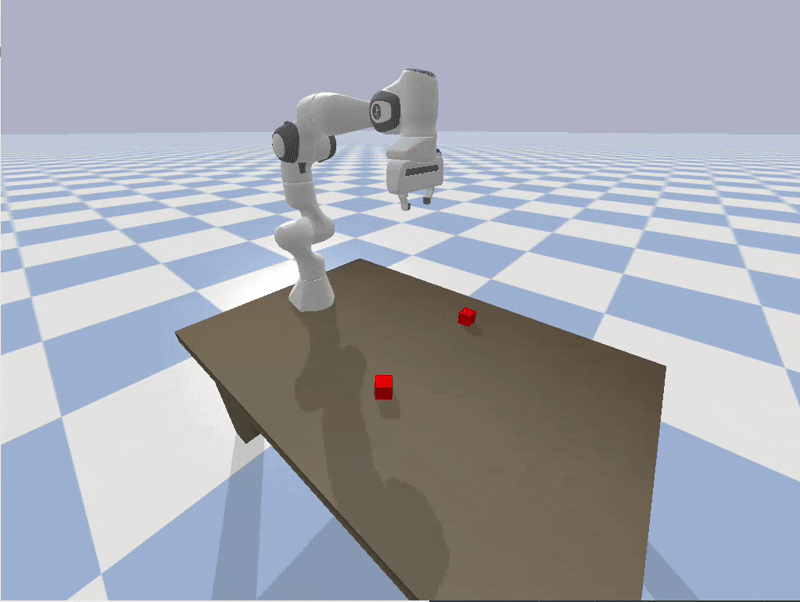

# panda-LM

a minimal implementation of language models for robot control

## Install and Run

```bash

# Download
git clone https://github.com/panda-sim/panda-LM.git
cd panda-LM

# Create and source virtual environment
python3 -m venv venv
source venv/bin/activate

# Install dependencies
pip install numpy pybullet
```

Before running the code, you should query a language model (LM) to help you complete `main.py`.
Use the text in `prompt.txt` to prompt the LM.
This LM should respond by asking you to `detect_object("block")`.
Based on the environment defined in `main.py`, you can provide this answer:
```
there are two blocks. Each block is a cube with sides of length 0.05

block1:
position is [0.6, -0.2, 0.025]
orientation is 0.7

block2:
position is [0.6, 0.3, 0.025]
orientation is 0
```
Paste the code generated by the LM at the bottom of `main.py`. Then run:
```bash
python3 main.py
```

## Expected Output

The robot should stack the two blocks on top of each other.
Here is one example of a successful task based on the code in `example-conversation.txt`:

